# Jenkins Integration
The sample demonstrates cpdctl integration with Jenkins CI/CD system, by the implementation of the 
AI Lifecycle Management scenario described in the [article](https://medium.com/@rafal.bigaj/12713ef04dc5). 

## Prerequisites
1. [IBM Cloud Pak for Data](https://www.ibm.com/products/cloud-pak-for-data), version 4.0.2 or above. 
2. [cpdctl](https://github.com/IBM/cpdctl) executable, version 1.1.15 or above.
3. Jenkins server with [Pipeline](https://plugins.jenkins.io/workflow-aggregator/), [GitHub](https://plugins.jenkins.io/github/) and [Copy Artifact](https://plugins.jenkins.io/copyartifact/) plugins installed. It is also possible to use Jenkins official
[Docker image](https://hub.docker.com/_/jenkins) to [setup](https://www.jenkins.io/doc/book/installing/docker/) an isolated
Jenkins instance.

### Cpdctl configuration
Detailed installation procedure of cpdctl can be found in the project [README](https://github.com/IBM/cpdctl/#installation). 
Configuration of the environment requires url of the CPD (Cloud Pak for Data) cluster, username and password, or username and apikey when
IAM integration is [enabled](https://www.ibm.com/docs/en/cloud-paks/cp-data/4.0?topic=tasks-integrating-iam-service).
To setup the cluster as a target environment in the cpdctl CLI follow the steps:
1. set the new context:
```shell
cpdctl config context set cpd402-demo --username=<cpd-username> --password=<cpd-password> --url <cpd-url>
```
  when IAM integration is enabled:
```shell
cpdctl config context set cpd402-demo --username=<cpd-username> --apikey=<cpd-apikey> --url <cpd-url>
```
2. successfully created context can be listed with the command:
```shell
cpdctl config context list
Name                 Profile                       User                       Current             
cpd402-demo          context_cpd402-demo_profile   context_cpd402-demo_user    
```
3. set the newly created context as a default for all commands
```shell
cpdctl config context use cpd402-demo
```

### Set up project and spaces on CPD cluster
Scenario requires also existing project with data assets used for training and evaluation task, as well as development 
and production deployment spaces. The following commands create and import all required items:
1. create a new project:
```shell
cpdctl project create --name cpd-jenkins-project --generator cpdctl --storage '{}'
```
2. use a project id returned by the previous command to import data assets:
```shell
cpdctl asset import start --project-id <project-id> --import-file project.zip
```
3. create development deployment space
```shell
cpdctl space create --name dev-space
```
4. in the similar way, create production space:
```shell
cpdctl space create --name production-space
```
Remember created space IDs, as you would need them, when running Jenkins pipelines. At any point in time you can access the space list with:
```shell
cpdctl space list
```

### Configure Jenkins
Jenkins pipelines used in the scenario loads the cpdctl configuration from the secret file, stored in the
Jenkins credentials. Also, to access the repository where pipeline definitions are located,
Jenkins jobs require GitHub credentials secret.

Cpdctl configuration file is located in the user home directory `~/.cpdctl/config`. It can be easily accessed
from the terminal, however, some system asset browser do not allow to select hidden directory. As a first step,
copy the `config` file to directory with an easy access, for example Desktop or Documents:
```shell
cp ~/.cpdctl/config ~/Desktop/config
```

To upload config file as a Jenkins secret, open the [credentials configuration panel](https://www.jenkins.io/doc/book/using/using-credentials/).
Add the credentials with the following configuration:
- Kind: Secret file
- File: Select cpdctl configuration file copied in the previous step
- ID: CPDCTL_CPD402_CONFIG
- Description: Description of the credentials

  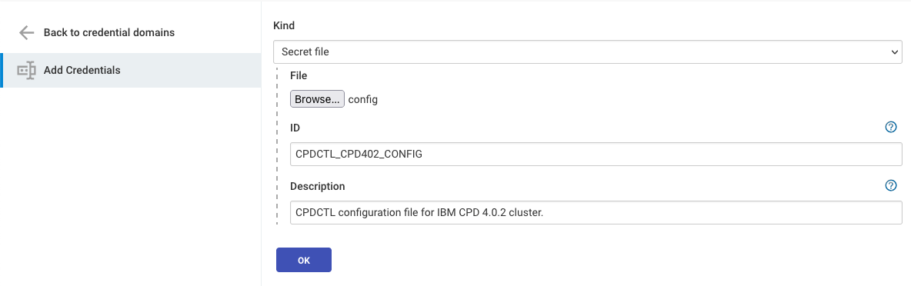

To consume development, test and production pipelines defined by the scenario, you need to create
three different Jenkins Pipeline [jobs](https://www.jenkins.io/doc/book/pipeline/getting-started/#through-the-classic-ui).

#### Development pipeline job
The first one, development, requires two String parameters:
- PROJECT_ID: ID of the project created in the cluster configuration section,
- DEV_SPACE_ID: ID of the development deployment space, also created in the previous step.

  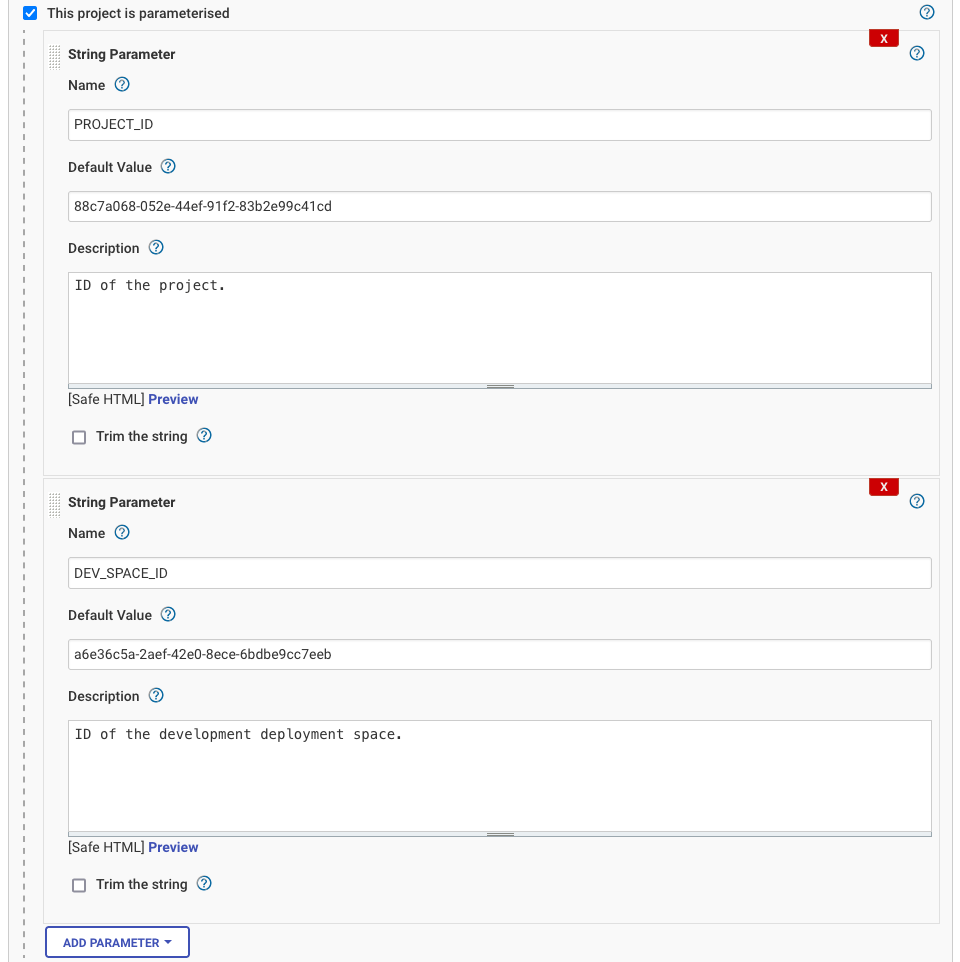

In the Pipeline section set the following fields:
- Definition: Pipeline script from SCM
- SCM: Git
- Repository URL: https://github.com/IBM/cpdctl.git
- Credentials: -none-
- Branch Specified: */master
- Script Path: samples/jenkins/pipelines/dev

  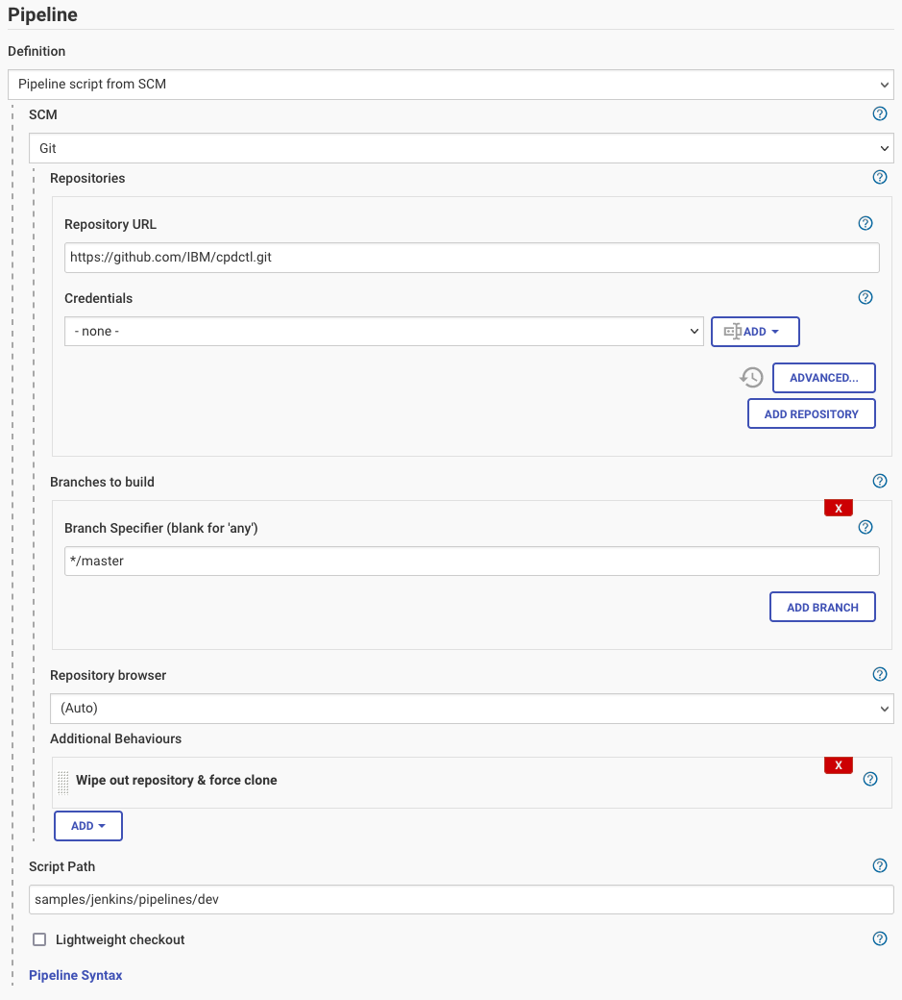

#### Test pipeline job
Similarly, create the pipeline job for the test pipeline. This job does not require any 
parameters, so the only thing to set is the Pipeline section:
- Definition: Pipeline script from SCM
- SCM: Git
- Repository URL: https://github.com/IBM/cpdctl.git
- Credentials: -none-
- Branch Specified: */master
- Script Path: samples/jenkins/pipelines/test

  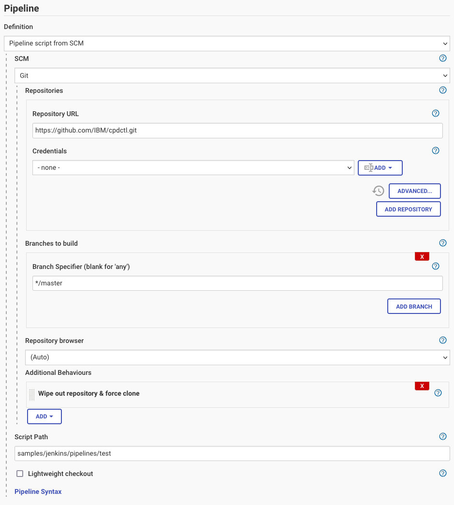

#### Production pipeline job
The last job, requires one String parameter:
- PROD_SPACE_ID: ID of the production deployment space

  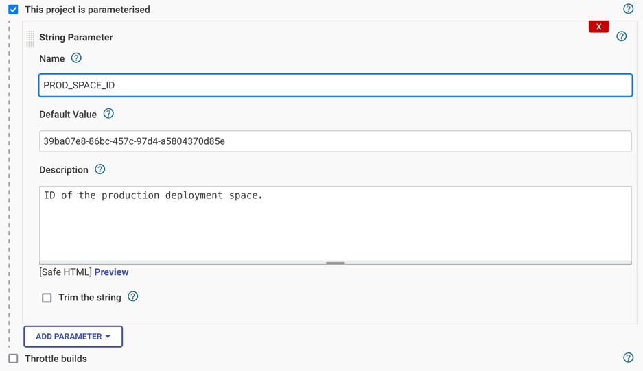

Pipeline configuration looks very similar to the previous ones:
- Definition: Pipeline script from SCM
- SCM: Git
- Repository URL: https://github.com/IBM/cpdctl.git
- Credentials: -none-
- Branch Specified: */master
- Script Path: samples/jenkins/pipelines/prod

  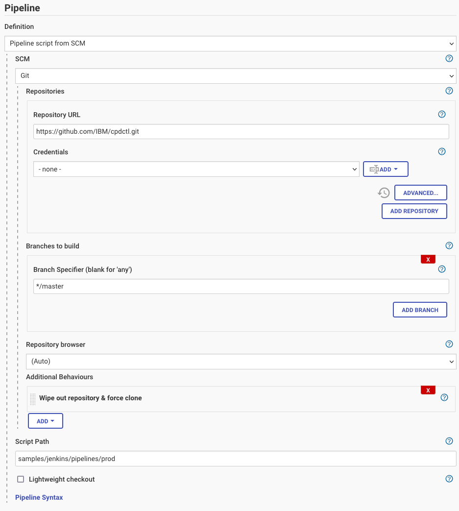

## Scenario implementation
The scenario implementation is split into three Scripted Jenkins pipelines. The definition of each pipeline is written
into text files, located in the [pipelines](pipelines) directory. The division matches the CI/CD pipelines described in the base scenario:
- development
- test
- production

All of the pipelines have some common steps, to set up a working environment, install dependencies or to define the stage:
1. `node` - allocates an executor on a build agent (node) and runs further code in the context of a workspace on that agent. 
In this sample, the default agent is used.
2. `withCredentials([file(credentialsId: 'CPDCTL_CPD402_CONFIG', variable: 'CPDCONFIG')])` - loads cpdctl configuration file
from a secret file uploaded to Jenkins in the Credentials section.
3. `checkout scm` - the code from the Source Control Management defined in the job configuration.
4. `stage` - defines the pipeline stage
5. `sh 'bash -e ...'` - executes bash script, waits for the result and fails the pipeline when script returns non-zero exit code

### Development pipeline
The pipeline, that trains the model, promotes it and exports assets as a Jenkins artifact consists of stages:
1. Install cdpctl - downloads and installs the latest cdpctl version using [install_cpdctl.sh](scripts/helpers/install_cpdctl.sh) script
2. Train model - trains the model using a notebook and datasets located in the project with the [train_model.sh](scripts/dev/train_model.sh) script 
3. Promote to DEV - executes [promote_to_dev_space.sh](scripts/dev/promote_to_dev_space.sh) to promote trained model from the 
project to the development deployment space
4. Export assets - executes [export_dev_space.sh](scripts/dev/export_dev_space.sh) to export assets from the development deployment space to an archive, 
then, using `archiveArtifacts` step, attach the archive to the Jenkins build as a build artifacts.
5. Cleanup - executes [cleanup.sh](scripts/dev/cleanup.sh) to delete all models, assets and jobs from the project.

### Test pipeline
Import of the artifacts from the previous job, model deployment and evaluation is defined in the test pipeline with the following stages:
1. Install cdpctl - same as in the development pipeline 
2. Import assets - using `copyArtifacts` step downloads artifacts archived in the development pipeline, then imports the archive to 
the newly created deployment space with [create_test_space.sh](scripts/test/create_test_space.sh) script.
3. Deploy model - deploys model with [create_model_batch_deployment.sh](scripts/test/create_model_batch_deployment.sh) script.
4. Evaluate model - evaluates model deployment using [create_script_batch_deployment.sh](scripts/test/create_script_batch_deployment.sh) script.
5. Cleanup - executes [cleanup.sh](scripts/test/cleanup.sh) to delete whole space with all assets.

### Production pipeline
Same as previously, the preparation part defines the default execution node and loads the secret file. Remaining steps: 
1. Install cpdctl - same as in the development pipeline
2. Import assets - update existing AI assets by importing them from the archive stored in the artifacts repository using 
[import_to_prod_space.sh](scripts/prod/import_to_prod_space.sh) script.
3. Update model deployment - executes [update_model_deployment.sh](scripts/prod/update_model_deployment.sh) script to redeploy the new improved model.
4. Evaluate the model - run regression tests to ensure the quality of the new model version using [run_model_deployment_validation.sh](scripts/prod/run_model_deployment_validation.sh) script, then attach the evaluation
results to the Jenkins job with `archiveArtifacts` step.
5. Update evaluation script deployment - redeploy the evaluation script using [update_script_deployment.sh](scripts/prod/update_script_deployment.sh) script.

## Run the scenario
When all configuration steps are done, it is a time to execute the scenario and look at the results.

### Development pipeline run
[Run](https://www.jenkins.io/doc/book/pipeline/getting-started/#through-the-classic-ui) development pipeline job with default parameters
and wait for completion:

  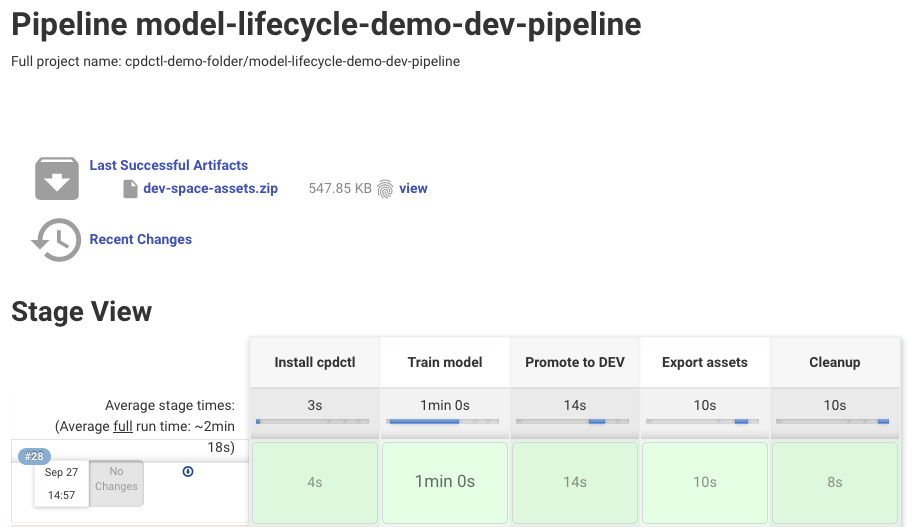

Artifacts created by the specific run can be found in the build details:

  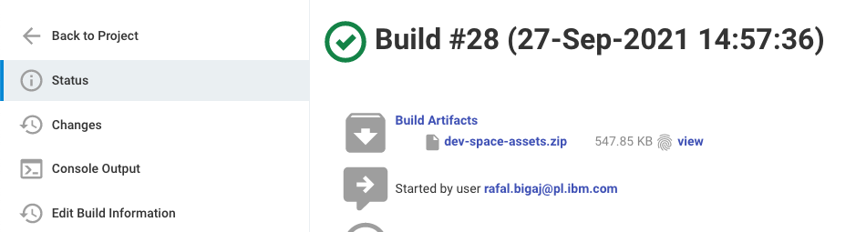

In the logs from the execution, available in the job `Console Output`, there are detailed outputs from bash scripts used 
by the pipeline, the most important logs are:
- cpdctl installation and version
```text
bash -e ./samples/jenkins/scripts/helpers/install_cpdctl.sh
cpdctl
Installed cpdctl in version:
1.1.15
```
- training of the model
```text
Searching for wml_model with name: gcr-scikit-model...
Found: 3438138c-f2d8-4509-8cfb-eef4a75aca5d
Model: 3438138c-f2d8-4509-8cfb-eef4a75aca5d trained successfully!
```
- asset export and archiving the artifacts
```text
bash -e ./samples/jenkins/scripts/dev/export_dev_space.sh
...
              
ID:        f8d9e6c8-0a75-435a-98d4-b4727ba063ed   
Name:      dev-space-all-assets   
Created:   2021-09-27T12:59:32.332Z   
State:     completed   
...
OK
Output written to ./dev-space-assets.zip
Archive:  ./dev-space-assets.zip
    testing: deflate.log              OK
   ...
```

### Test pipeline run
Build the second, test job and wait for completion:

  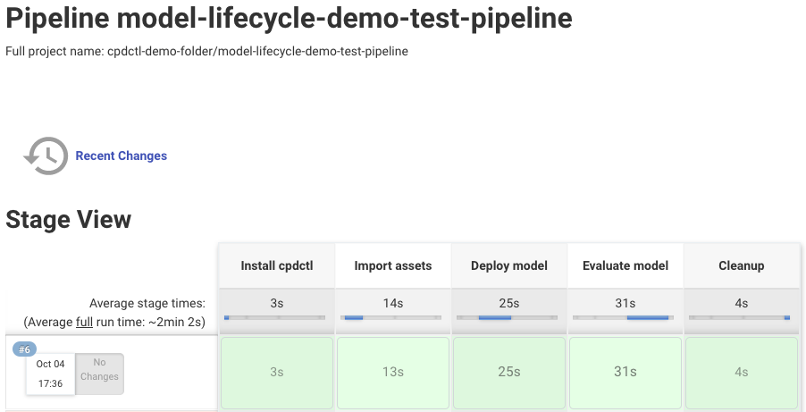

There are no artifacts attached to the build:

  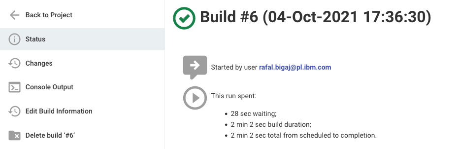

However, there are some important logs from the execution:
- copy artifacts from the development job
```text
Copied 1 artifact from "cpdctl-demo-folder » model-lifecycle-demo-dev-pipeline" build number 28
```
- creation of the batch deployment
```text
bash -e ./samples/jenkins/scripts/test/create_model_batch_deployment.sh
Searching for wml_model with name: gcr-scikit-model...
Found: 7be1c2dd-3356-4be0-8f0d-d604ec1162b2
Searching for script with name: evaluate_model*...
Found: 5c411705-2869-488e-922d-57115948a1e5
Searching for data_asset with name: credit_risk_regression.csv...
Found: 63139151-37b8-440f-aa5e-2fbc81cf635e
Batch deployment: d2078a08-daa1-40b1-9d2a-c30caa92fac2 created for an asset: 7be1c2dd-3356-4be0-8f0d-d604ec1162b2...
Starting job model_batch_deployment_job...
Run: 73dcf015-ec95-4c1e-9149-61339a8597d8 started for a job: 4c013ef3-d2c9-48ff-81ec-0b89369c4feb...
...
                  
ID:            73dcf015-ec95-4c1e-9149-61339a8597d8   
Name:          job run   
Created:       2021-10-04T15:37:39Z   
Description:      
State:         Completed   
Tags:          []   
Results scoring_results.csv : dee1c8e5-d8a2-4124-a0b2-25e0ae4ed348 for a run: 73dcf015-ec95-4c1e-9149-61339a8597d8...
```
- model evaluation
```text
bash -e ./samples/jenkins/scripts/test/create_script_batch_deployment.sh
Searching for wml_model with name: gcr-scikit-model...
Found: 7be1c2dd-3356-4be0-8f0d-d604ec1162b2
Searching for script with name: evaluate_model*...
Found: 5c411705-2869-488e-922d-57115948a1e5
Searching for data_asset with name: credit_risk_regression.csv...
Found: 86d8733a-bd26-46fd-8914-9f347cd17769
Batch deployment: 28aa99a9-d0f7-4fa1-84f9-c3046c332ead created for an asset: 5c411705-2869-488e-922d-57115948a1e5...
Starting job evaluate_model_batch_deployment_job...
Run: ac2f4d26-1921-4319-9954-13c62327b6f3 started for a job: 2eb9c362-ea9b-49b6-92e6-e1ab73f7f5bb...
...
                  
ID:            ac2f4d26-1921-4319-9954-13c62327b6f3   
Name:          job run   
Created:       2021-10-04T15:38:04Z   
Description:      
State:         Completed   
Tags:          []   
Results : 0f8bfd28-782a-45d9-a9e6-e2a4c004786a for a run: ac2f4d26-1921-4319-9954-13c62327b6f3...
Downloading: model_evaluation_result.zip to the job_results.zip...
...
OK
Output written to job_results.zip
Unziping job_results.zip to results.txt
Model validation succeeded!
```
### Production pipeline run
Trigger run of the latest pipeline, to finish the scenario:

  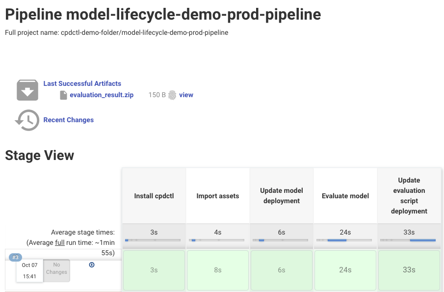

When completed, evaluation results will be attached to the job:

  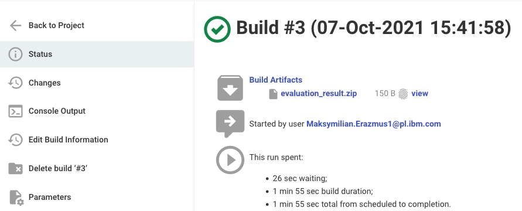

Important logs from the execution:
- import of the assets to production deployment spaces
```text
bash -e ./samples/jenkins/scripts/prod/import_to_prod_space.sh
Archive:  ./dev-space-assets.zip
...
              
ID:        64e855cc-cd32-4d21-910c-38d20bbd6ef2   
Created:   2021-10-07T13:42:43.632Z   
State:     completed   
```
- create model revision and update of the deployment
```text
bash -e ./samples/jenkins/scripts/prod/update_model_deployment.sh
Model id: 8a5c5a4c-ee6f-4490-a3a2-00f5291eb6a2
Model revision: 5
Batch deployment id: eb1a0453-42f3-47fc-8549-6686dfc080cb
...
              
ID:        eb1a0453-42f3-47fc-8549-6686dfc080cb   
Name:      model-batch-deployment   
Created:   2021-10-01T08:37:49.014Z   
State:     ready   
Tags:      []   
Updated deployed model revision:
{
  "id": "8a5c5a4c-ee6f-4490-a3a2-00f5291eb6a2",
  "rev": "5"
}
```
- update of the script and production model evaluation
```text
bash -e ./samples/jenkins/scripts/prod/update_script_deployment.sh
Searching for script with name: evaluate_model...
Found: 5beb782f-90b6-4976-8a0c-7f1985baa6f6
Evaluation script id: 5beb782f-90b6-4976-8a0c-7f1985baa6f6
Existing production deployment ID: e4991c10-3738-4165-a715-f09b8f6486e3
...
              
ID:        e4991c10-3738-4165-a715-f09b8f6486e3   
Name:      script-batch-deployment   
Created:   2021-10-01T08:41:12.107Z   
State:     ready   
Tags:      []   
Production job ID: 9a00f230-ceab-4117-ab18-22e7ca261625
ID of the job run in production space: fe96f566-8f96-4a43-8ddd-9495f6254aa1
...
                  
ID:            fe96f566-8f96-4a43-8ddd-9495f6254aa1   
Name:          job run   
Created:       2021-10-07T13:43:27Z   
Description:      
State:         Completed   
Tags:          []   
Searching for data_asset with name: evaluation_result.zip...
Found: d22a8426-8f71-42eb-9f4d-ac9853e94eae
Results : d22a8426-8f71-42eb-9f4d-ac9853e94eae for a run: ...
Downloading: evaluation_result.zip to the prod_job_results.zip...
...
OK
Output written to prod_job_results.zip
Unziping prod_job_results.zip to results.txt
Model validation succeeded!
```
## Jenkins terminology and steps used in the sample
The key Jenkins concepts used to automate AI Lifecycle process:
- [Jenkins pipelines](https://www.jenkins.io/doc/book/pipeline/)
- [node](https://www.jenkins.io/doc/pipeline/steps/workflow-durable-task-step/#node-allocate-node)
- [stage](https://www.jenkins.io/doc/book/pipeline/#stage)
- [withCredentials step](https://www.jenkins.io/doc/book/pipeline/jenkinsfile/#handling-credentials)
- [checkout step](https://www.jenkins.io/doc/pipeline/steps/workflow-scm-step/)
- [sh step](https://www.jenkins.io/doc/pipeline/steps/workflow-durable-task-step/#sh-shell-script)
- [archiveArtifacts step](https://www.jenkins.io/doc/pipeline/tour/tests-and-artifacts/)
- [copyArtifacts step](https://www.jenkins.io/doc/pipeline/steps/copyartifact/)

## References
1. [AI Lifecycle scenario](https://medium.com/@rafal.bigaj/12713ef04dc5)
2. [Jenkins](https://www.jenkins.io/)

